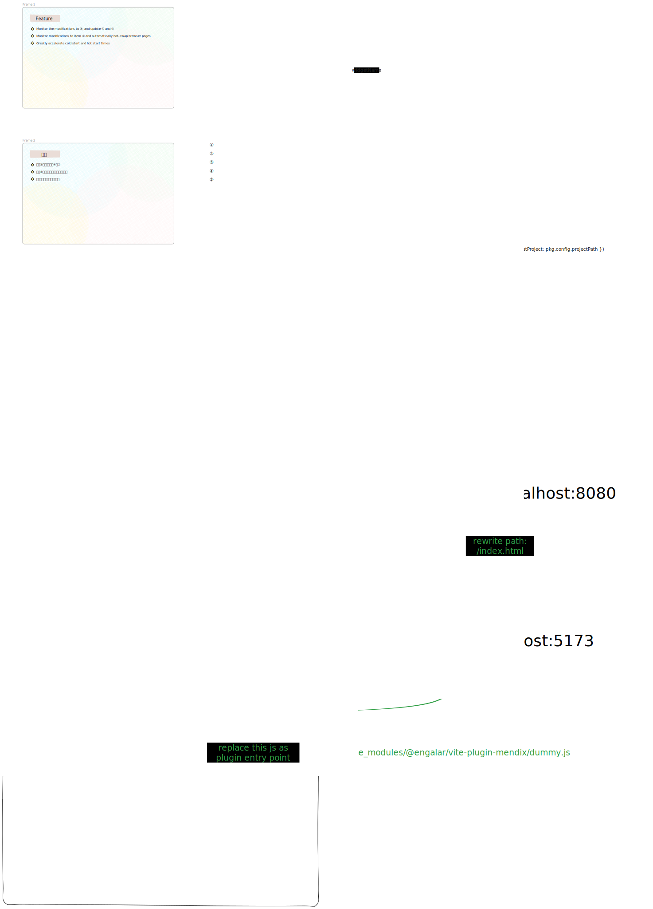

# start up

## install

```shell
npm install -D vite @engalar/vite-plugin-mendix
```

## config

copy `@engalar/vite-plugin-mendix/config/rollup.config.typing.js` and `@engalar/vite-plugin-mendix/config/rollup.config.js` to your project root

package.json

````json
scripts: {
    "vite:start": "vite --config node_modules/@engalar/vite-plugin-mendix/config/_vite_config.js",
    "vite:build": "set __DEV_VITEJS__=true && npm run build",
    //...
}
```

# schema pictue


````
